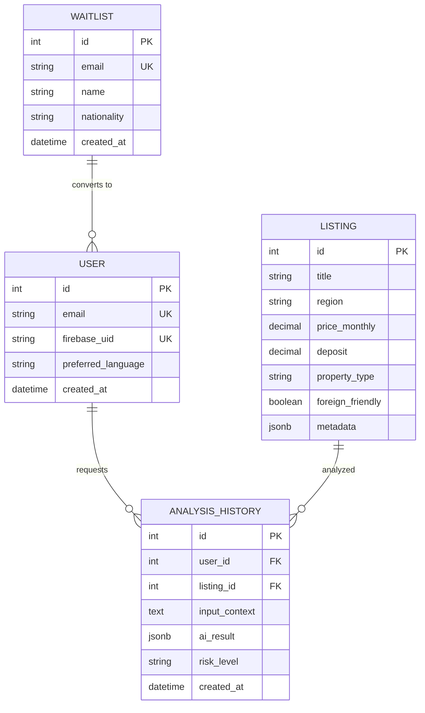

# 데이터베이스 모델 설계서 (Database Model)

이 문서는 VDN 프로젝트의 데이터 구조를 정의하며, **SQLModel**을 사용하여 **AWS RDS (PostgreSQL)** 환경에 최적화된 스키마를 설명합니다.

## 1. 개요
- **ORM**: SQLModel (SQLAlchemy + Pydantic 기반)
- **Database**: PostgreSQL (AWS RDS)
- **주요 목표**: 외국인 사용자의 데이터와 부동산 매물, AI 분석 이력을 효율적으로 관리

## 2. 엔티티 관계도 (ERD - Conceptual)


## 3. 상세 테이블 정의 (SQLModel Class)

### 3.1. 대기자 명단 (Waitlist)
얼리액세스 신청자를 관리합니다.
```python
from sqlmodel import SQLModel, Field
from datetime import datetime
from typing import Optional

class Waitlist(SQLModel, table=True):
    id: Optional[int] = Field(default=None, primary_key=True)
    email: str = Field(index=True, unique=True)
    name: str
    nationality: str
    status: str = Field(default="pending")  # pending, contacted, converted
    created_at: datetime = Field(default_factory=datetime.utcnow)
```

### 3.2. 부동산 매물 (Listing)
외국인 친화적인 매물 정보를 저장합니다.
```python
class Listing(SQLModel, table=True):
    id: Optional[int] = Field(default=None, primary_key=True)
    title: str
    region: str  # 구/동 단위
    price_monthly: float
    deposit: float
    property_type: str  # Studio, Villa, Apartment
    foreign_friendly: bool = Field(default=False)
    description: Optional[str] = None
    created_at: datetime = Field(default_factory=datetime.utcnow)
```

### 3.3. AI 분석 이력 (AnalysisHistory)
사용자의 매물 분석 또는 데모 체험 이력을 저장합니다.
```python
from sqlalchemy.dialects.postgresql import JSONB
from sqlalchemy import Column

class AnalysisHistory(SQLModel, table=True):
    id: Optional[int] = Field(default=None, primary_key=True)
    user_id: Optional[int] = Field(default=None, foreign_key="user.id")
    listing_id: Optional[int] = Field(default=None, foreign_key="listing.id")
    input_context: str  # 사용자의 고민이나 상황
    ai_result: dict = Field(default={}, sa_column=Column(JSONB))
    risk_level: str  # Safe, Caution, High Risk
    created_at: datetime = Field(default_factory=datetime.utcnow)
```

## 4. 인덱스 및 최적화 전략
- **Email Index**: `Waitlist`와 `User` 테이블의 이메일 필드에 인덱스를 부여하여 빠른 조회 보장.
- **Region Index**: 매물 검색 시 가장 많이 사용되는 `region` 필드에 인덱스 설정.
- **JSONB 사용**: AI 분석 결과와 같이 구조가 가변적인 데이터는 PostgreSQL의 `JSONB` 타입을 사용하여 유연성과 성능 동시 확보.

## 5. 데이터 마이그레이션 및 관리
- **Alembic**: 스키마 변경 이력 관리를 위해 Alembic 사용 권장.
- **RDS Connectivity**: AWS Chalice 환경에서 VPC 설정을 통해 RDS와 안전하게 통신.
